# System & Scoring Diagram

## How the Auction Works

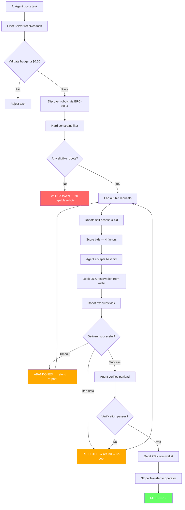

---

## The Scoring Function

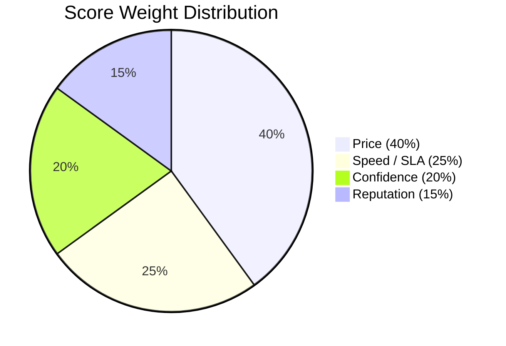

### How Each Factor Is Computed

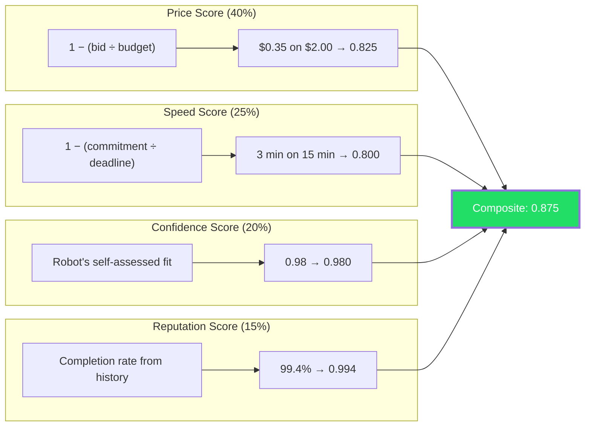

### Why Cheapest Doesn't Always Win

```mermaid
xychart-beta
    title "Robot X ($0.40) vs Robot Y ($0.60)"
    x-axis ["Price", "Speed", "Confidence", "Reputation", "TOTAL"]
    y-axis "Weighted Score" 0 --> 0.9
    bar [0.320, 0.083, 0.140, 0.120, 0.663]
    bar [0.280, 0.217, 0.194, 0.149, 0.840]
```

> Robot Y costs 50% more but wins because speed + confidence + reputation (60% of the score) outweigh the price advantage (40%).

---

## State Machine

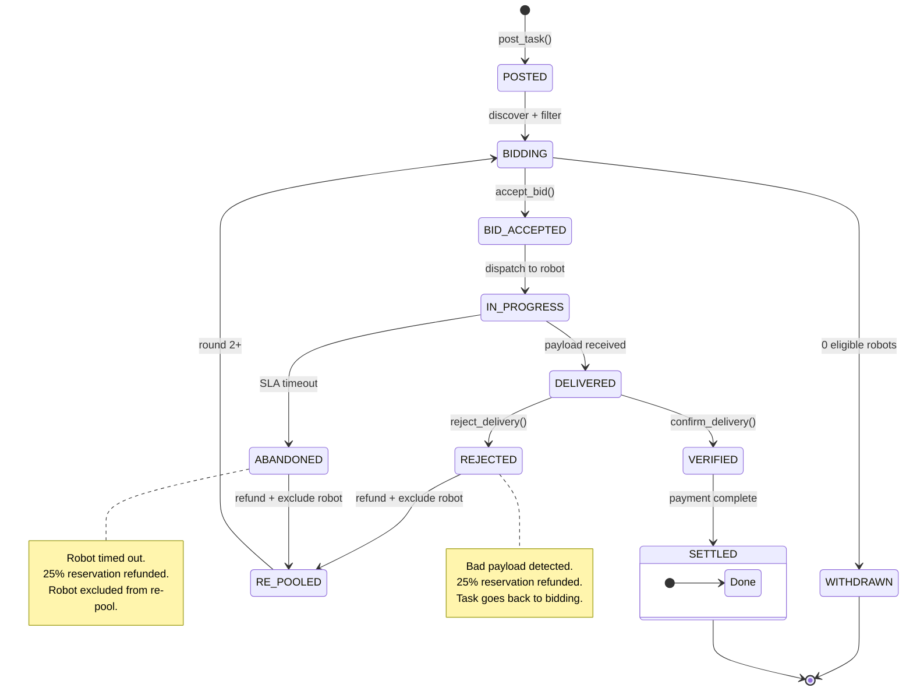

---

## Payment Flow

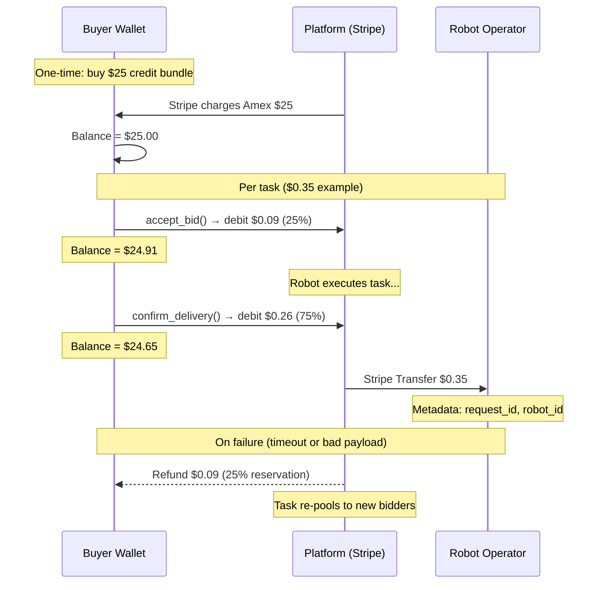

---

## Failure Recovery

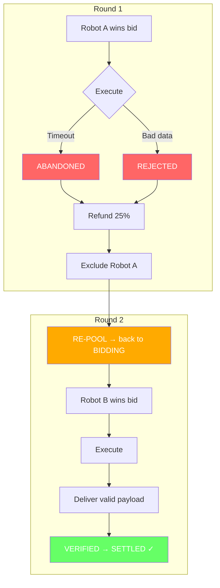

---

## Architecture Overview

### How the Marketplace Connects to yakrover-8004-mcp

The marketplace is a module that layers on top of the existing MCP robot framework. It doesn't replace anything — it adds auction, payment, and scoring capabilities to robots that are already controllable via MCP.

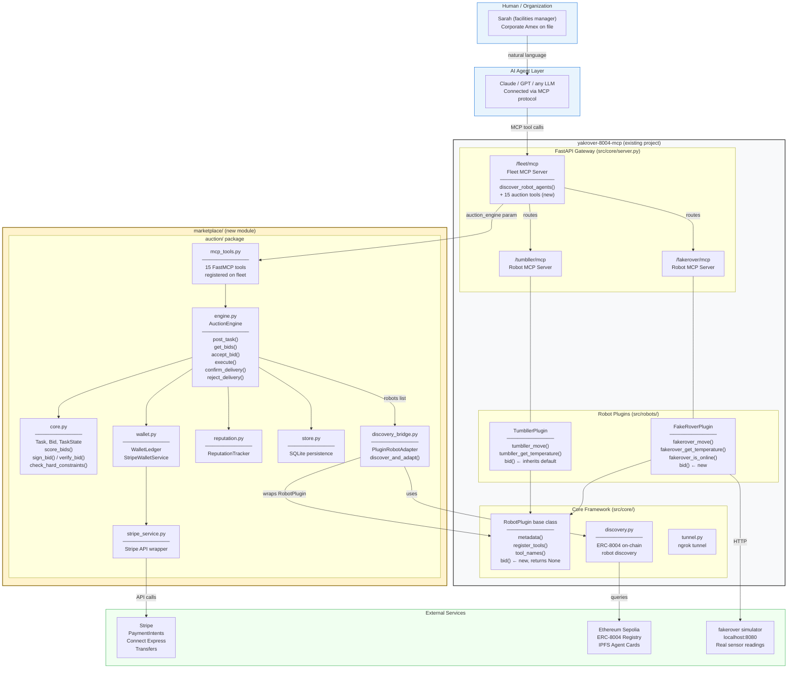

### What Connects Where

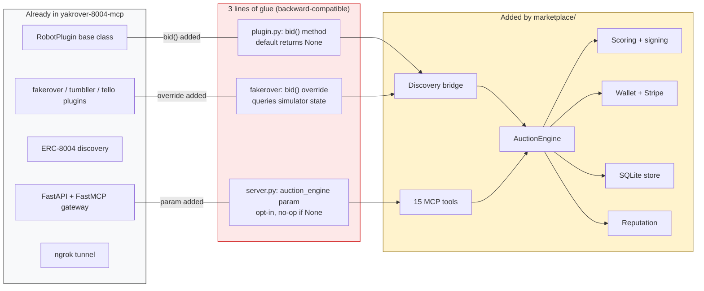

### MCP Tool Surface

The fleet server at `/fleet/mcp` exposes these tools to any connected LLM:

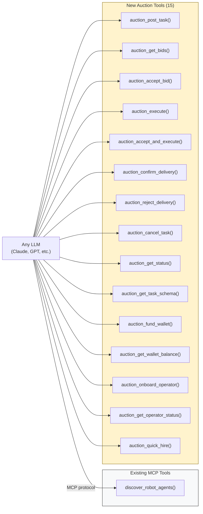

### The Full Stack (bottom to top)

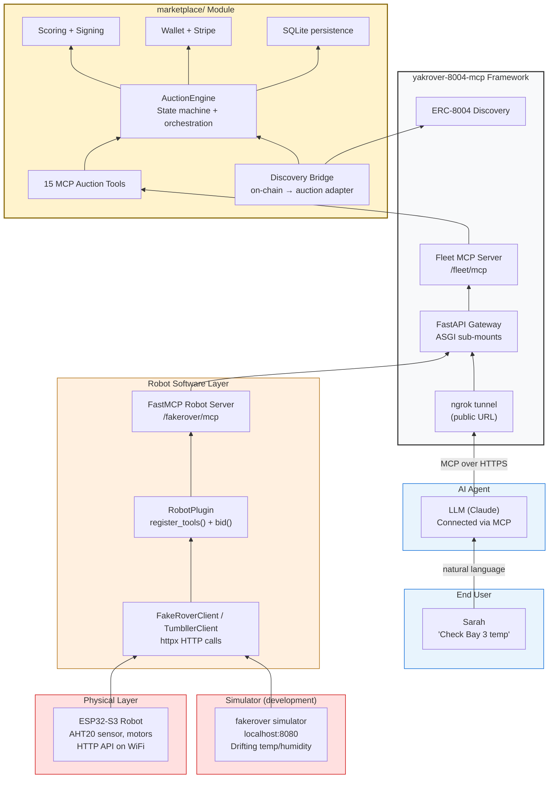
