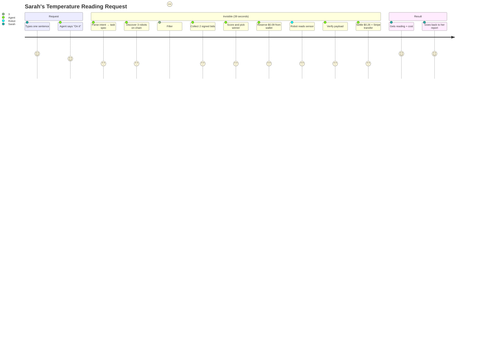
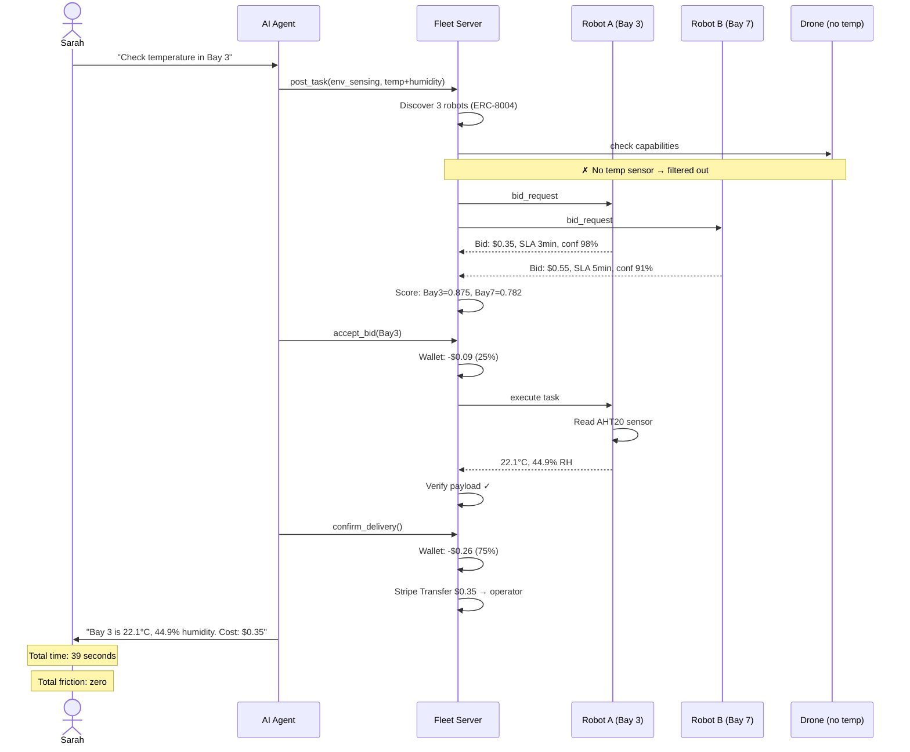
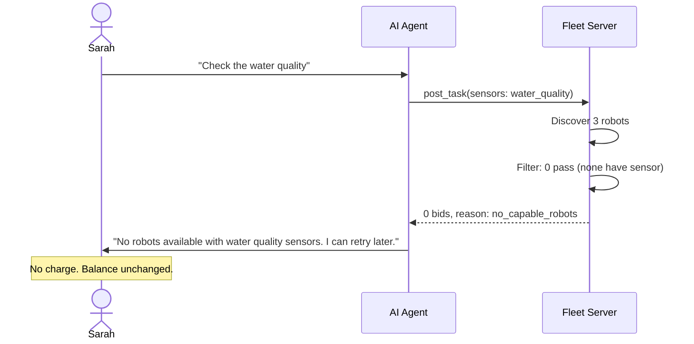
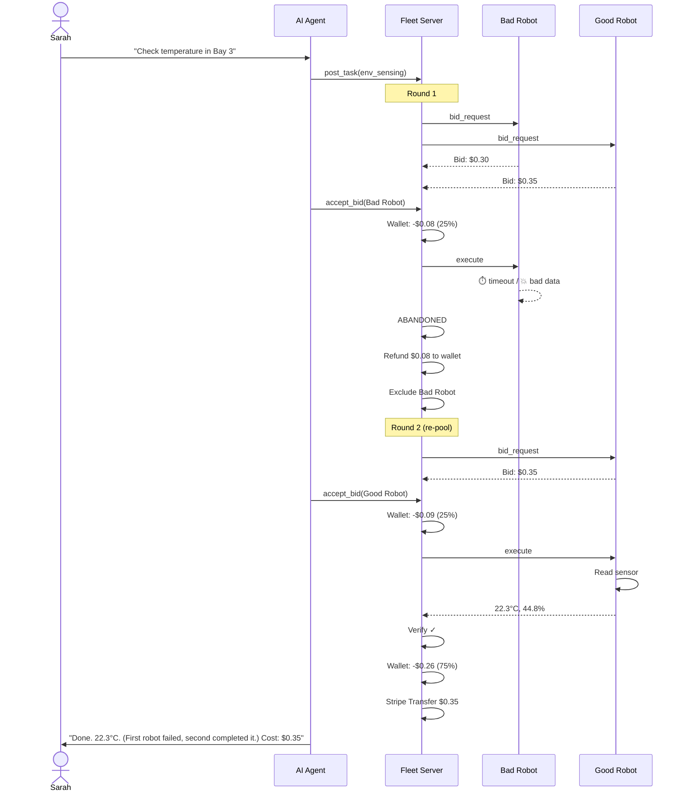
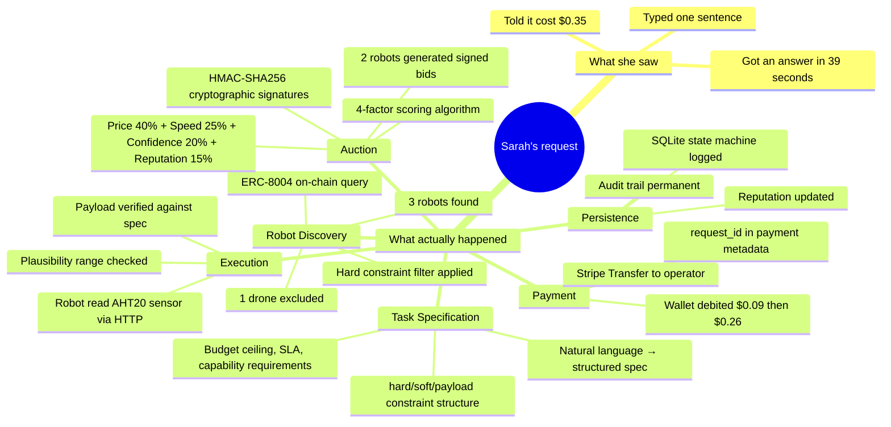
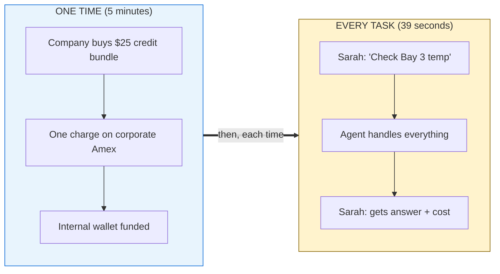
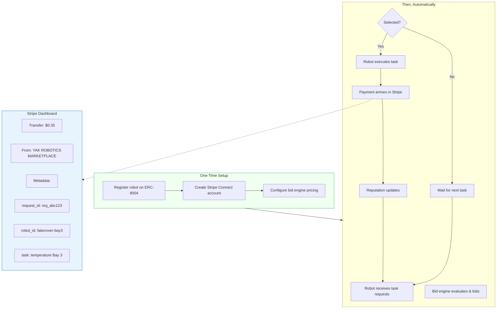
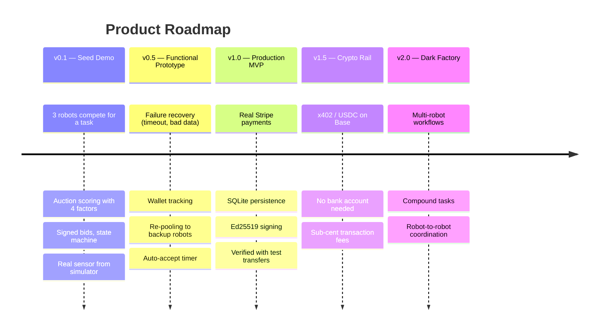

# User Journey Diagram

## The Experience — What Sarah Sees

---

## The One-Call Path: `auction_quick_hire`

For simple tasks, the agent uses a single MCP tool call — `auction_quick_hire` — that runs the entire auction lifecycle (post, bid, accept, execute, confirm) and returns the sensor data. The sequence diagrams below show the individual steps that happen inside that one call.

---

## Three Journeys — Sequence Diagrams

### Journey A — Everything Works

### Journey B — No Robots Available

### Journey C — Robot Fails, System Recovers

---

## What Sarah Never Saw

---

## One-Time Setup vs. Every Task

---

## What the Robot Operator Sees

---

## From Seed to Scale

